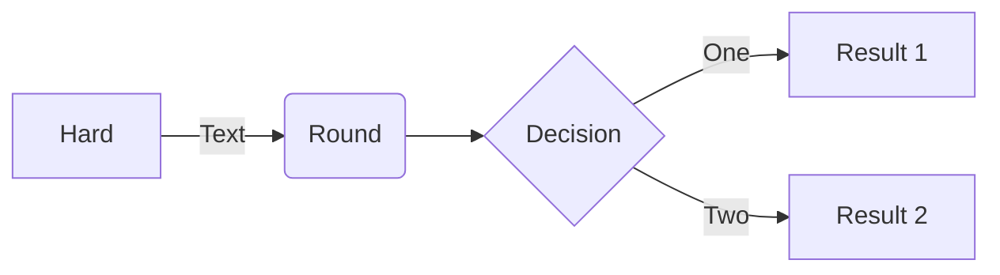

Тимохина Валерия, 021 гр.

моя персональная страница

viktorina - викторина питон

Untitled6 (1).py - база данных sql

python шпора.ipynb - шпаргалка по питону

команды sql - список команд и логических операторов sql

схема по подготовке к ЕГЭ https://lucid.app/lucidchart/a29fa9ff-353a-4e28-9468-b0d875781288/edit?viewport_loc=-477%2C-206%2C3581%2C1674%2C0_0&invitationId=inv_3bc18e49-2126-4e45-aade-74845144c3a8

формулы:

$$\overline{E}_{1}^{2}=\sqrt{\frac{\mathrm{F}\mathrm{a}^{\mathrm{x}-1}}{\left( \mathrm{x}-1 \right)\cdot \mathrm{x}}}+\mathrm{a}_1^{\frac{1}{2}}+\beta_2^{\frac{2}{3}}$$

$$\mathrm{S}_x=\frac{\mathrm{v}_x^{2}-\mathrm{v}_0^{2}}{2\mathrm{a}_x}$$

$$\mathrm{x}=\mathrm{x}_0+\mathrm{v}_0 \mathrm{t}+\frac{\mathrm{a}\mathrm{t}^{2}}{2}$$

$$\mathrm{E}=\mathrm{k}\frac{\left| q_{ш} \right|}{\varepsilon\left( \mathrm{R}+\mathrm{r}^{2} \right)}$$

